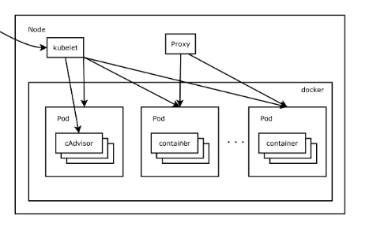

# openstack->cloud native
cloud native or openstack are all solution to provide a reliable/scable/ distributed framework.
* the openstack aim to provide a framework based on VM, developer deploy their program in 1 or many VM.Althoug the openstack is welcomed by the cloud provided, because they can sell VM in terms like memory, cpu power, bandwidth. 
* but from developer's view, the VM is costly and too slow. so the Kubernetes was made .

# docker vs VM
个人理解docker 是介于 virtual env 与 virtual machine 之间的概念.
* virtualenv就是用来为一个应用创建一套“隔离”的Python运行环境。virtualenv为应用提供了隔离的Python运行环境，解决了不同应用间多版本的冲突问题。
* virtual machine 是由hypervisor模拟一台电脑的完整启动环境

>Some virtual machines, such as QEMU, are designed to also emulate different architectures and allow execution of software applications and operating systems written for another CPUor architecture. Operating-system-level virtualizationallows the resources of a computer to be partitioned via the kernel's support for multiple isolated user spaceinstances, which are usually called containersand may look and feel like real machines to the end users.
* docker:只是记录一个执行环境,如python所需要的所有库文件, 不记录状态,如需要则关联到数据卷（Volumes）和挂载主机目录（Bind mount）. Docker 使用 Google 公司推出的 Go 语言进行开发实现，基于 Linux 内核的 cgroup，namespace，以及 AUFS类的 Union FS等技术，对进程进行封装隔离，属于 操作系统层面的虚拟化技术。docker 里面只有rootfs, 没有 kernel, 它当然不需要跟虚拟机里的guest os 一样 boot 一遍.

# why container?
程序部署的传统方法是指通过操作系统包管理器在主机上安装程序。这样做的缺点是，容易混淆程序之间以及程序和主机系统之间的可执行文件、配置文件、库、生命周期。
容器部署的新的方式是基于操作系统级别的虚拟化，而非硬件虚拟化。容器彼此是隔离的，与宿主机也是隔离的：它们有自己的文件系统，彼此之间不能看到对方的进程，分配到的计算资源都是有限制的。它们比虚拟机更容易搭建。并且由于和基础架构、宿主机文件系统是解耦的，它们可以在不同类型的云上或操作系统上转移。

正因为容器又小又快，每一个容器镜像都可以打包装载一个程序。这种一对一的“程序 - 镜像”联系带给了容器诸多便捷。由于容器镜像是在编译/发布期创建的，因此整个过程与基础架构解耦。

# why k8s?
Kubernetes 这个单词来自于希腊语，含义是 舵手 或 领航员 。其词根是 governor 和 cybernetic。 K8s 是它的缩写，用 8 字替代了“ubernete”.k8s 是 CNCF （Cloud Native Computing Foundation）的首个毕业项目。

Kubernetes 能在实体机或虚拟机集群上调度和运行程序容器。而且，Kubernetes 也能让开发者斩断联系着实体机或虚拟机的“锁链”，从以主机为中心的架构跃至以容器为中心的架构。 

# Kubernetes concept
[A running Kubernetes cluster contains node agents (kubelet) and master components (APIs, scheduler, etc), on top of a distributed storage solution. ](https://github.com/kubernetes/kubernetes/blob/release-1.3/docs/design/architecture.md)

Kubernetes is based on docker, but it encapsulate many logic terms:
## node:
a physical or virtual machine

## pod:
the unit of deployment, here you can configure memory, cpu power, bandwidth requirement.

它由⼀个或者多个容器组成（ 例如Docker容器） ， 它们共享容器存储、 ⽹络和容器运⾏配置项。 Pod中的容器总是被同时调度， 有共同的运⾏环境。Pod中的容器共享IP地址和端⼝号， 它们之间可以通过 localhost 互相发现。 它们之间可以通过进程间通信， 例如SystemV信号或者POSIX共享内存。 不同Pod之间的容器具有不同的IP地址， 不能直接通过IPC通信。Pod中的容器也有访问共享volume的权限， 这些volume会被定义成pod的⼀部分并挂载到应⽤容器的⽂件系统中。pod被创建后， 被分配⼀个唯⼀的ID（ UID） ， 调度到节点上， 并⼀致维持期望的状态直到被终结（ 根据重启策略） 或者被删除。Volume跟pod有相同的⽣命周期（ 当其UID存在的时候） 。 当Pod因为某种原因被删除或者被新创建的相同的Pod取代， 它相关的东⻄（ 例如volume） 也会被销毁和再创建⼀个新的volume。

## deployment:
here you ask the k8s for reliable/scable. the Yaml file is just a contract, via the contract, the k8s monitor the, recovery the failed pod, scale up/down.

k8s 中抽象出了 Deployment 的概念，对 ReplicaSet 模型中 Pod 的更新进行支持。目前支持两种更新策略：
* Recreate：销毁所有在运行的 Pod 后进行重建，这种策略的问题是会带来 downtime
* RollingUpdate：滚动升级，符合期望的两点目标

k8s 中的更新策略为 RollingUpdate，通过两个参数来配置具体的更新方法：
* max unavailable：指定能够同时进行更新的 Pod 的个数
* max surge：在更新过程中能够使用的额外的 Pod 的个数

Deployment 为 Pod 和 ReplicaSet 提供了⼀个声明式定义(declarative)⽅法(不需要写第一步第二步....)， ⽤来替代以前的ReplicationController 来⽅便的管理应⽤。 典型的应⽤场景包括：
* 定义Deployment来创建Pod和ReplicaSet
* 滚动升级和回滚应⽤
* 扩容和缩容
* 暂停和继续Deployment

## service:
在**微服务**架构里，多个微服务间需要进行通信，当每个应用部署到 pod 上之后，这里存在两个挑战：
* pod 间：不能使用写死的 IP，因为 Pod 可能会漂移到其他节点上，更换IP
* 对外：希望使用所有能够提供服务的 Pod，同时支持负载均衡
因此 k8s 提供了 Service 的概念，Service 定义了一个 Pod 的逻辑组，这些 Pod 提供相同的功能服务。Service 根据类型不同分为如下几类：

  * ClusterIP Service：这是默认的 Service 类型，该类型 Service 对外暴露一个集群内部 IP，可以用于集群内部服务间的通信
  * NodePort Service：该类型 Service 对外暴露集群上所有节点的固定端口，支持外部通过 <NodeIP>:<NodePort> 进行访问
  * LoadBalancer：该类 Service 通过云平台提供的 load balancer 向外提供服务
  * ExternalName：将服务映射到一个 externalName （比如 http://foo.bar.example.com)
  * 此外，还可以使用 Ingress 来向外暴露服务，Ingress 虽然不是一个 Service 的类型，但也可以充当你应用集群的入口，通过编写路由规则实现流量路由。

## ingress
Kubernetes中为了实现服务实例间的负载均衡和不同服务间的服务发现，创造了Serivce对象，同时又为从集群外部访问集群创建了Ingress对象。

在 Kubernetes 集群中，每个 Node 运行一个kube-proxy进程。kube-proxy负责为Service实现了一种 VIP（虚拟 IP）的形式，从 Kubernetes v1.2 起，默认就是 iptables 代理。

## env
* env 直接配置
* 通过ConfigMap 导入env. onfigMap: 一个 kv 的配置格式，可以用来配置 pods，实现 image 重用，支持在线修改
* 通过Secret 导入env. Secret:功能和 ConfigMap 相同，但是以 base64 加密存储

## volume
*  Persistent Volumes: 生命周期与使用它的 Pod 的生命周期解耦,不能直接和 Pod 关联，需要 Persistent Volumes Claim.
*  Persistent Volumes Claim
   - 是一个用户对存储的请求
   - 在存储的角色类似于 Pod，Pod 消耗 Node 资源，而 Persistent Volumes Claim 消耗 Persistent Volumes 资源
   - 提供抽象的存储资源，列出需要存储满足的要求，而不是直接使用 Persistent Volumes

## label/annotation
客户端／用户可以指定一个object集合，通过label selector对object的集合进行分组。
标签label可以让用户按照自己的喜好组织资源。 注释annotation让用户在资源里添加客户信息，以优化工作流程，为管理工具提供一个标示调试状态的简单方法。

## dashboard
此外，Kubernetes 控制面板是由开发者和用户均可使用的同样的 API 构建的。用户可以编写自己的控制器，比如 调度器scheduler，使用可以被通用的命令行工具识别的他们自己的 API。

这种设计让大量的其它系统也能构建于 Kubernetes 之上。

# k8s工作模型：
*  ReplicaSet
保证总有指定个数的 Pod 在运行
通过 pod selector 和 pod label 进行选择，将哪些 Pod 包含进来
适用于几乎无状态的服务
例子：静态 web 服务器

*  DaemonSet
保证每个宿主机上运行一个 Pod
通过 node selector 和 node label 进行选择，将哪些 Node 包含进来
适用于一些节点常驻服务
例子：各类 agent、log 收集、监控服务

* Job
在 ReplicaSet 和 DaemonSet 中，如果 Pod 的进程退出了（即使正确退出），进程也会重启
Job 则允许 Pod 中的进程正常退出，且不会再重启
适用于指定次数执行任务的场景
例子：数据备份操作

* CronJob
基于时间来调度和创建 Job

* StatefulSets
有稳定的网络标示和数据存储
Pod 创建按顺序：索引从低到高
Pod 销毁按顺序：索引从高到低
适用于有状态的服务
例子：数据库

# summary
将上述的概念做一个小结：
* 最小计算单元 = Pod
* 最小通信单元 = Service
* 分组 = Labels
* 配置 = env,ConfigMap 和 Secrets
* 无状态 Pod 调度 = ReplicaSet、DaemonSet、Job
* 更新部署 = Deployment
* 有状态 Pod 调度 = StatefulSet
* 存储 = Persistent Volumes 以及之上的 Persistent Volumes Claim

# another view
https://zhuanlan.zhihu.com/p/139965100

那么问题来了，面对一堆的服务器，我们要怎么实现一个容器编排系统呢？

先假设我们已经实现了这个编排系统，那么我们的服务器就会有一部分会用来运行这个编排系统，剩下的服务器用来运行我们的业务容器，我们把运行编排系统的服务器叫做 **master** 节点，把运行业务容器的服务器叫做 **worker** 节点。

既然 master 节点负责管理服务器集群，那它就必须要提供出相关的管理接口，一个是方便运维管理员对集群进行相关的操作，另一个就是负责和 worker 节点进行交互，比如进行资源的分配、网络的管理等。

我们把 master 上提供管理接口的组件称为 **kube apiserver**，对应的还需要两个用于和 **api server 交互的客户端**，一个是提供给集群的运维管理员使用的，我们称为 **kubectl**；一个是提供给 worker 节点使用的，我们称为 **kubelet**。

现在集群的运维管理员、master 节点、worker 节点已经可以彼此间进行交互了，比如说运维管理员通过 kubectl 向 master 下发一个命令，“用淘车网用户中心 2.0 版本的镜像创建 1000个 容器”，master 收到了这个请求之后，就要根据集群里面 worker 节点的资源信息进行一个计算调度，算出来这 1000 个容器应该在哪些 worker 上进行创建，然后把创建指令下发到相应的 worker 上。我们把这个负责调度的组件称为 **kube scheduler**。

那 master 又是怎么知道各个 worker 上的资源消耗和容器的运行情况的呢？这个简单，我们可以通过 worker 上的 **kubelet 周期性的主动上报节点资源和容器运行的情况**，然后 master 把这个数据存储下来，后面就可以用来做调度和容器的管理使用了。至于数据怎么存储，我们可以写文件、写 db 等等，不过有一个开源的**存储系统叫 etcd**，满足我们对于数据一致性和高可用的要求，同时安装简单、性能又好，我们就选 etcd 吧。

现在我们已经有了所有 worker 节点和容器运行的数据，我们可以做的事情就非常多了。比如前面所说的，我们使用淘车网用户中心 2.0 版本的镜像创建了 1000 个容器，其中有5个容器都是运行在 A 这个 worker 节点上，那如果 A 这个节点突然出现了硬件故障，导致节点不可用了，这个时候 master 就要把 A 从可用 worker 节点中摘除掉，并且还需要把原先运行在这个节点上的 5 个用户中心 2.0 的容器重新调度到其他可用的 worker 节点上，使得我们用户中心 2.0 的容器数量能够重新恢复到 1000 个，并且还需要对相关的容器进行网络通信配置的调整，使得容器间的通信还是正常的。我们把这一系列的组件称为控制器，比如节点控制器、副本控制器、端点控制器等等，并且为这些控制器提供一个统一的运行组件，称为控制器管理器（**kube-controller-manager**）。

那 master 又该如何实现和管理容器间的网络通信呢？首先每个容器肯定需要有一个唯一的 ip 地址，通过这个 ip 地址就可以互相通信了，但是彼此通信的容器有可能运行在不同的 worker 节点上，这就涉及到 worker 节点间的网络通信，因此每个 worker 节点还需要有一个唯一的 ip 地址，但是容器间通信都是通过容器 ip 进行的，容器并不感知 worker 节点的 ip 地址，因此在 worker 节点上需要有容器 ip 的路由转发信息，我们可以通过 iptables、ipvs 等技术来实现。那如果容器 ip 变化了，或者容器数量变化了，这个时候相关的 iptables、ipvs 的配置就需要跟着进行调整，所以在 worker 节点上我们需要一个专门**负责监听并调整路由转发配置**的组件，我们把这个组件称为 **kube proxy**（此处为了便于理解，就不展开引入 Service 的内容了）。

我们已经解决了容器间的网络通信，但是在我们编码的时候，我们希望的是通过域名或者 vip 等方式来调用一个服务，而不是通过一个可能随时会变化的容器 ip。因此我们需要在容器 ip 之上在封装出一个 Service 的概念，这个 Service 可以是一个集群的 vip，也可以是一个集群的域名，为此我们还需要一个集群内部的 DNS 域名解析服务。

另外虽然我们已经有了 kubectl，可以很愉快的和 master 进行交互了，但是如果有一个 web 的管理界面，这肯定是一个更好的事情。此处之外，我们可能还希望看到容器的资源信息、整个集群相关组件的运行日志等等。像 DNS、web 管理界面、容器资源信息、集群日志，这些可以**改善我们使用体验的组件，我们统称为插件**。

至此，我们已经成功构建了一个容器编排系统，我们来简单总结下上面提到的各个组成部分：

* Master 组件：kube-apiserver、kube-scheduler、etcd、kube-controller-manager
* Node 组件：kubelet、kube-proxy
* 插件：DNS、用户界面 Web UI、容器资源监控、集群日志