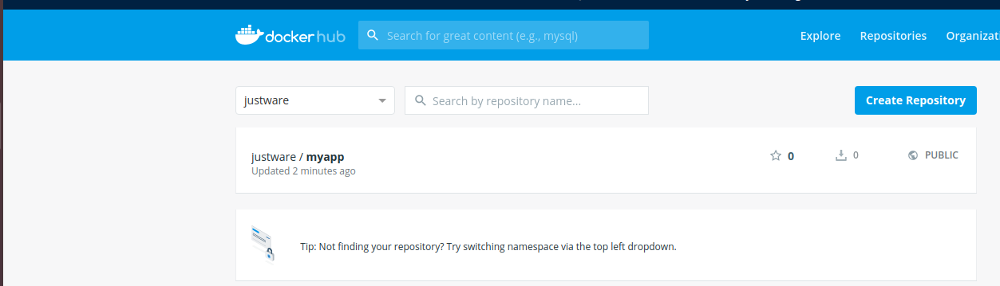

# overview
* [the linux kernel to support docker](netLec7.pdf)
* [home page of docker](https://docs.docker.com/get-docker/)


docker 只是记录一个执行环境,如python所需要的所有库文件, 不记录状态,如需要则关联到数据卷（Volumes）和挂载主机目录（Bind mount）. Docker 使用 Google 公司推出的 Go 语言进行开发实现，基于 Linux 内核的 cgroup，namespace，以及 AUFS类的 Union FS等技术，对进程进行封装隔离，属于 操作系统层面的虚拟化技术。

a docker system in Linux is comprised of
* docker client
* daemon,  client<->daemon 是c/s 关系, docker daemon 也称 docker engine.
* libcontainer, 对container 进行管理.

# build/ship/run
* image发布者: commit , push
* ship; dockhub 作为registry
* image使用者: pull, run

# 镜像（Image）和容器（Container）的关系，

容器的实质是进程，但与直接在宿主执行的进程不同，容器进程运行于属于自己的独立的 命名空间。因此容器可以拥有自己的 root文件系统、自己的网络配置、自己的进程空间，甚至自己的用户 ID 空间。容器内的进程是运行在一个隔离的环境里，使用起来，就好像是在一个独立于宿主的系统下操作一样。(alex: sandbox)

image : 静态的一个包,是一个定制的rootfs, 并且unionfs是分层,可以复用的. 通过dockerfile 创建.docker镜像由多个文件系统（只读层）叠加而成，当我们启动一个容器时，docker会加载只读层镜像并在其上（即镜像栈顶部）添加一个读写层。如果已经运行的容器修改了现有的文件，那么会从读写层下面的只读层复制到读写层，该文件只读层依然存在，只是已经被读写层中该文件的复制副本所隐藏。(alex: 颇有linux的 copy on write 之风)当删除docker容器，或重新启动时，之前的修改将丢失。在docker中，只读层及在顶部的读写层组合被称为Union File System（联合文件系统）

e.g.

```bash
$ sudo docker images
REPOSITORY          TAG                 IMAGE ID            CREATED             SIZE
hello-world         latest              4ab4c602aa5e        2 weeks ago         1.84kB
redis               latest              e1a73233e3be        2 weeks ago         83.4MB

$ sudo docker ps -a
CONTAINER ID        IMAGE               COMMAND                  CREATED             STATUS                    PORTS               NAMES
ad86114d2c0a        redis               "docker-entrypoint.s…"   23 seconds ago      Up 22 seconds             6379/tcp            tender_dijkstra
6713d16fa7dc        redis               "docker-entrypoint.s…"   2 hours ago         Up 2 hours                6379/tcp            eager_elbakyan
5e3266b1da2b        redis               "docker-entrypoint.s…"   46 hours ago        Exited (0) 46 hours ago                       quirky_jennings
80d9c46e29d1        hello-world         "/hello"                 47 hours ago        Exited (0) 47 hours ago                       hungry_albattani
```
可见镜像（Image）和容器（Container）的关系就类似可执行文件和process的关系。

# 数据卷（Volume）
按照 Docker 最佳实践的要求，容器不应该向其存储层内写入任何数据，容器存储层要保持无状态化。所有的文件写入操作，都应该使用 数据卷（Volume）、或者绑定宿主（host computer or host VM）目录，在这些位置的读写会跳过容器存储层，直接对宿主（或网络存储）发生读写，其性能和稳定性更高。数据卷的生存周期独立于容器，容器消亡，数据卷不会消亡。因此，使用数据卷后，容器删除或者重新运行之后，数据却不会丢失。

Volume两种方式创建：

① 容器中使用主机的某个目录，可以通过-v参数指定（注：注意冒号前后的内容）

docker run -v /host/path:/some/path ···

-v [本机地址]:[容器的文件系统的地址]

相当于linux的link命令，让宿主机的文件或者文件夹，与容器共享

② 在dockerfile中指定VOLUME /path

```bash
$ sudo docker volume create --driver local docker_data
docker_data

$ sudo docker volume list
DRIVER              VOLUME NAME
local               282b44bd7ca333ccf9384492553164f24d53ff2281028e03c59c4e42fe5e5e38
local               63eb620ecae717c9f5224d4e79ee4f3331b67eae1fa4c452f0736cf09b097417
local               a581185c117e4fe3db9de8fabcd02bc9e760dfd0aa58adbc54b91d7ade06db53
local               docker_data

$ sudo docker volume rm docker_data 
docker_data

```

# container间路由
alex: Linux 在网络栈中引入网络命名空间，将独立的网络协议栈隔离到不同的命令空间中，彼此间无法通信；Docker 利用这一特性，实现不容器间的网络隔离，并且引入 Veth 设备对来实现在不同网络命名空间的通信。Linux 系统包含一个完整的路由功能，当 IP 层在处理数据发送或转发的时候，会使用路由表来决定发往哪里。

以两个container在运行为例，通过bridge实现了互通。

```bash
$ sudo docker network ls
NETWORK ID          NAME                DRIVER              SCOPE
07aac6be8b5c        bridge              bridge              local
7c26b74fdab4        host                host                local
b4cb21683a90        none                null                local

$ sudo docker network inspect bridge 

        "Containers": {
            "92481f287dfb242bf120f7ee6a1749ab6a7998d2fb3e7887b7e363a5a809645d": {
                "Name": "alpine",
                "EndpointID": "683e5adfc696518a6adc8a88cd8c2e442b2e51a1b35c6e84762170670762f766",
                "MacAddress": "02:42:ac:11:00:02",
                "IPv4Address": "172.17.0.2/16",
                "IPv6Address": ""
            },
            "fed93ceadb769626eaf2227da458b2ef8a9da8fac532ecd3b21557c416bd63d8": {
                "Name": "trusting_murdock",
                "EndpointID": "5f4e4a20c1773680b122fbad5368375805c51b6dd1ca3819365149cfa5c8aa82",
                "MacAddress": "02:42:ac:11:00:03",
                "IPv4Address": "172.17.0.3/16",
                "IPv6Address": ""
            }
        }        
```

# install docker Community Edition 
* [offical guide](https://docs.docker.com/engine/install/ubuntu/)

Docker Community Edition (CE) is ideal for developers and small teams looking to get started with Docker and experimenting with container-based apps.

```bash
$ uname -a
Linux minipc 5.3.0-51-generic #44~18.04.2-Ubuntu SMP Thu Apr 23 14:27:18 UTC 2020 x86_64 x86_64 x86_64 GNU/Linux

```
## check status

```bash
$ sudo systemctl status docker
docker.service - Docker Application Container Engine
   Loaded: loaded (/lib/systemd/system/docker.service; enabled; vendor preset: enabled)
   Active: active (running) since Fri 2020-05-15 07:05:59 CST; 11min ago

$ docker -v 
Docker version 19.03.8, build afacb8b7f0
```

if uninstall

```bash
$ sudo apt-get purge docker-ce
```

# manager container

* docker ps
* docker start/stop/rm
* docker inspect/port/stat
* docker logs
* docker attach

# manage volume
* docker volume

# commit
对Container 修改后，可以用 docker commit 命令永久话，就是创建一个新image.

e.g. 
"Small！Simple！Secure！Alpine Linux is a security-oriented, lightweight Linux distribution based on musl libc and busybox.”
以Alpine Linux image 为基础创建自己的image.

```bash
$ sudo docker pull alpine  
$ sudo docker run -it alpine
$ docker ps -a
CONTAINER ID        IMAGE               COMMAND                  CREATED             STATUS                         PORTS               NAMES
fed93ceadb76        alpine              "/bin/sh"                About an hour ago   Up 22 seconds                                      trusting_murdock
$ sudo docker exec -it trusting_murdock  sh
```
在container中做些改动,如生成一个文本文件 ,容器实际会在Image上增加一个读写文件层，我们可以将已经运行的容器通过docker comit生成新的镜像：

```bash
$ sudo docker commit  trusting_murdock  alpine_alex
$ sudo docker images
REPOSITORY          TAG                 IMAGE ID            CREATED             SIZE
alpine_alex         latest              fddcc73fc820        7 seconds ago       5.71MB
$ sudo docker run -it --name alpine  alpine_alex 
```
可以看到生成的文本文件在新的container 中.

# docker build

如何从头生成一个镜像呢？我们可以通过docker build来进行。

# export container
```bash
$ docker export --help
$ sudo docker export <id> > myUbuntu.tar
```
# create image from file
Using docker rm, docker rmi to delete image/container
```bash
$ docker import --help
$ cat myUbuntu.tar | docker import - ubuntu:1.1
```
# tag
image 起一个别名

在Docker中，最容易产生误解的部分应该是latest这个标签。困惑主要是由于这个名字造成的，因为字面意思并不能表达它的真正含义。在本文中，我们来学习下latest标签的真正作用和如何正确使用它。

通常有两种方式来对镜像打标签：使用docker tag命令或者是在执行docker build的时候用-t来传递参数。在这两种情况下，参数的形式通常是repository_name:tag_name，例如：docker tag myrepo:mytag。如果这个资源库被上传到了Docker Hub，资源库的名字会加上一个由Docker Hub用户名和斜线组成的前缀，例如：amouat/myrepo:mytag。如果没有添加tag部分的参数，例如：docker tag myrepo:1.0 myrepo，Docker会自动的给它latest标签。前面这些内容或许你已经熟知，其实它也就这点内容，并没有什么神奇的地方。

不能因为镜像的标签是latest就认为这是资源库中最新的镜像。只有这个资源库的拥有者约定这样，拥有latest标签的镜像才一定是最新的镜像。

# push
将 commit 的image发布到[Docker Hub](https://hub.docker.com/).

```bash
$ docker login
Authenticating with existing credentials...
WARNING! Your password will be stored unencrypted in /home/alex/.docker/config.json.
Configure a credential helper to remove this warning. See
https://docs.docker.com/engine/reference/commandline/login/#credentials-store

Login Succeeded

$ docker tag myapp:1.0 justware/myapp:1.0
$ docker push justware/myapp:1.0
The push refers to repository [docker.io/justware/myapp]
d4c8f5d190a4: Pushed 
d881dabde4f7: Pushed 
3e207b409db3: Pushed 
Post https://registry-1.docker.io/v2/justware/myapp/blobs/uploads/: net/http: TLS handshake timeout
$ docker push justware/myapp:1.0
The push refers to repository [docker.io/justware/myapp]
d4c8f5d190a4: Layer already exists 
d881dabde4f7: Layer already exists 
3e207b409db3: Layer already exists 
1.0: digest: sha256:b007de3d4823b1e89b9521fba6f652bb667ab097f39cd92c3ea5c07e1189af1d size: 945
$ 

```



# stop docker daemon
```bash
c$ sudo systemctl stop docker
c$ sudo systemctl status docker
```