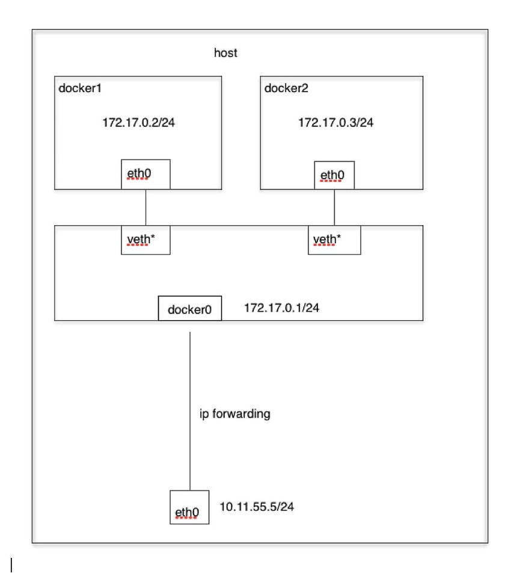
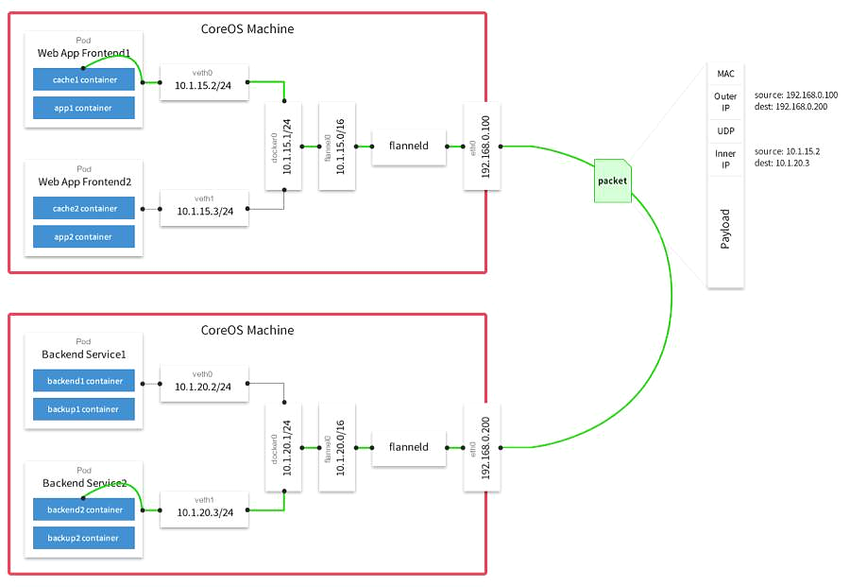

# pull/run Redis image
默认情况下，Docker从[Docker Hub](https://hub.docker.com/)中提取这些镜像

```bash
$ sudo docker search redis
$ sudo docker pull redis:6.0.1
1:M 15 May 2020 00:17:51.519 * Ready to accept connections

$ sudo docker images
REPOSITORY          TAG                 IMAGE ID            CREATED             SIZE
redis               6.0.1               f9b990972689        12 days ago         104MB
$ sudo docker run -it redis
Unable to find image 'redis:latest' locally
latest: Pulling from library/redis
....
1:M 15 May 2020 00:17:51.519 * Ready to accept connections

$ sudo docker images
REPOSITORY          TAG                 IMAGE ID            CREATED             SIZE
redis               6.0.1               f9b990972689        12 days ago         104MB
redis               latest              f9b990972689        12 days ago         104MB
```
看来TAG很重要，即使同一image ID，也要用TAG区分.

# check image

```bash
$ sudo docker inspect redis

        "Id": "sha256:f9b9909726890b00d2098081642edf32e5211b7ab53563929a47f250bcdc1d7c",
        "RepoTags": [
            "redis:6.0.1",
            "redis:latest"
        ],

        "RootFS": {
            "Type": "layers",
            "Layers": [
                "sha256:c2adabaecedbda0af72b153c6499a0555f3a769d52370469d8f6bd6328af9b13",
                "sha256:744315296a49be711c312dfa1b3a80516116f78c437367ff0bc678da1123e990",
                "sha256:379ef5d5cb402a5538413d7285b21aa58a560882d15f1f553f7868dc4b66afa8",
                "sha256:d00fd460effb7b066760f97447c071492d471c5176d05b8af1751806a1f905f8",
                "sha256:4d0c196331523cfed7bf5bafd616ecb3855256838d850b6f3d5fba911f6c4123",
                "sha256:98b4a6242af2536383425ba2d6de033a510e049d9ca07ff501b95052da76e894"
            ]
        },

```
docker镜像由多个文件系统（只读层）叠加而成，当我们启动一个容器时，docker会加载只读层镜像并在其上（即镜像栈顶部）添加一个读写层。如果已经运行的容器修改了现有的文件，那么会从读写层下面的只读层复制到读写层，改文件只读层依然存在，只是已经被读写层中该文件的复制副本所隐藏。当删除docker容器，或重新启动时，之前的修改将丢失。在docker中，只读层及在顶部的读写层组合被称为**Union File System**联合文件系统）


# check container

Get its ip

```bash
$ sudo docker ps
 
CONTAINER ID        IMAGE               COMMAND                  CREATED             STATUS              PORTS               NAMES
181f88bd0f2a        redis               "docker-entrypoint.s…"   15 seconds ago      Up 13 seconds       6379/tcp            upbeat_hopper
$ sudo docker inspect 181f88bd0f2a

        "Image": "sha256:f9b9909726890b00d2098081642edf32e5211b7ab53563929a47f250bcdc1d7c",
        "ResolvConfPath": "/var/lib/docker/containers/181f88bd0f2ad5074a3911d1b34b37c267efbf3e351e8b6cccd455055ee8ecab/resolv.conf",
        "HostnamePath": "/var/lib/docker/containers/181f88bd0f2ad5074a3911d1b34b37c267efbf3e351e8b6cccd455055ee8ecab/hostname",
        "HostsPath": "/var/lib/docker/containers/181f88bd0f2ad5074a3911d1b34b37c267efbf3e351e8b6cccd455055ee8ecab/hosts",
        "LogPath": "/var/lib/docker/containers/181f88bd0f2ad5074a3911d1b34b37c267efbf3e351e8b6cccd455055ee8ecab/181f88bd0f2ad5074a3911d1b34b37c267efbf3e351e8b6cccd455055ee8ecab-json.log",
        "Name": "/upbeat_hopper",

        "Mounts": [
            {
                "Type": "volume",
                "Name": "9d3aa4440b7d8cbfa4db7eadf24c4c8409fe094249fe86033d53319789c701ca",
                "Source": "/var/lib/docker/volumes/9d3aa4440b7d8cbfa4db7eadf24c4c8409fe094249fe86033d53319789c701ca/_data",
                "Destination": "/data",
                "Driver": "local",
                "Mode": "",
                "RW": true,
                "Propagation": ""
            }
        ],

        "NetworkSettings": {
            "Bridge": "",
            "SandboxID": "e932c5dca4ad7e6597ddc3e1ef59a33c4c28cfcef42e0d451eda55be0d4233ba",
            "HairpinMode": false,
            "LinkLocalIPv6Address": "",
            "LinkLocalIPv6PrefixLen": 0,
            "Ports": {
                "6379/tcp": null
            },
            "SandboxKey": "/var/run/docker/netns/e932c5dca4ad",
            "SecondaryIPAddresses": null,
            "SecondaryIPv6Addresses": null,
            "EndpointID": "662281a3185431b03cc5f7d3e620621d85f99f63ae9e83e951a70824faf18148",
            "Gateway": "172.17.0.1",
            "GlobalIPv6Address": "",
            "GlobalIPv6PrefixLen": 0,
            "IPAddress": "172.17.0.2",
            "IPPrefixLen": 16,
            "IPv6Gateway": "",
            "MacAddress": "02:42:ac:11:00:02",
            "Networks": {
                "bridge": {
                    "IPAMConfig": null,
                    "Links": null,
                    "Aliases": null,
                    "NetworkID": "4f704f69d88c7310b2ed454a1c18bb1aebbd8e4bed5c95cfb86617d271ed9c60",
                    "EndpointID": "662281a3185431b03cc5f7d3e620621d85f99f63ae9e83e951a70824faf18148",
                    "Gateway": "172.17.0.1",
                    "IPAddress": "172.17.0.2",
                    "IPPrefixLen": 16,
                    "IPv6Gateway": "",
                    "GlobalIPv6Address": "",
                    "GlobalIPv6PrefixLen": 0,
                    "MacAddress": "02:42:ac:11:00:02",
                    "DriverOpts": null
                }
            }
        }

```
按照 Docker 最佳实践的要求，容器不应该向其存储层内写入任何数据，容器存储层要保持无状态化。所有的文件写入操作，都应该使用 数据卷（Volume）、或者绑定宿主目录，在这些位置的读写会跳过容器存储层，直接对宿主（或网络存储）发生读写，其性能和稳定性更高。

数据卷的生存周期独立于容器，容器消亡，数据卷不会消亡。因此，使用数据卷后，容器删除或者重新运行之后，数据却不会丢失.

即使你不配置，系统还是会给每个Redis container配置了name, volume.

## check network docker related
```bash
$ sudo docker network ls
NETWORK ID          NAME                DRIVER              SCOPE
4f704f69d88c        bridge              bridge              local
8f6c4bc4e467        host                host                local
84a819e11e59        none                null                local

$ ifconfig
docker0: flags=4163<UP,BROADCAST,RUNNING,MULTICAST>  mtu 1500
        inet 172.17.0.1  netmask 255.255.0.0  broadcast 172.17.255.255
        inet6 fe80::42:dbff:fe21:505d  prefixlen 64  scopeid 0x20<link>
        ether 02:42:db:21:50:5d  txqueuelen 0  (Ethernet)
        RX packets 0  bytes 0 (0.0 B)
        RX errors 0  dropped 0  overruns 0  frame 0
        TX packets 65  bytes 8979 (8.9 KB)
        TX errors 0  dropped 0 overruns 0  carrier 0  collisions 0

$ route
Kernel IP routing table
Destination     Gateway         Genmask         Flags Metric Ref    Use Iface
default         _gateway        0.0.0.0         UG    600    0        0 wlp2s0
link-local      0.0.0.0         255.255.0.0     U     1000   0        0 wlp2s0
172.17.0.0      0.0.0.0         255.255.0.0     U     0      0        0 docker0
192.168.3.0     0.0.0.0         255.255.255.0   U     600    0        0 wlp2s0

$ sudo docker network inspect bridge 
```
Linux 在网络栈中引入网络命名空间，将独立的网络协议栈隔离到不同的命令空间中，彼此间无法通信. Docker 利用这一特性，实现不容器间的网络隔离，并且引入**Veth设备**对来实现在不同网络命名空间的通信。Linux 系统包含一个完整的路由功能，当 IP 层在处理数据发送或转发的时候，会使用路由表来决定发往哪里。

当Docker进程启动时，会在主机上创建一个名为docker0的虚拟网桥，此主机上启动的Docker容器会连接到这个虚拟网桥上。虚拟网桥的工作方式和物理交换机类似，这样主机上的所有容器就通过交换机连在了一个二层网络中。从docker0子网中分配一个IP给容器使用，并设置docker0的IP地址为容器的默认网关。在主机上创建一对虚拟网卡veth pair设备，Docker将veth pair设备的一端放在新创建的容器中，并命名为eth0（容器的网卡），另一端放在主机中，以vethxxx这样类似的名字命名，并将这个网络设备加入到docker0网桥中。可以通过brctl show命令查看。

bridge模式是docker的默认网络模式，不写--net参数，就是bridge模式。



跨主机通信

Docker默认的网络环境下，单台主机上的Docker容器可以通过docker0网桥直接通信，而不同主机上的Docker容器之间只能通过在主机上做端口映射进行通信。这种端口映射方式对很多集群应用来说极不方便。如果能让Docker容器之间直接使用自己的IP地址进行通信，会解决很多问题。按实现原理可分别直接路由方式、桥接方式（如pipework）、Overlay隧道方式（如flannel、ovs+gre）等。



Flannel实现的容器的跨主机通信通过如下过程实现：
* 每个主机上安装并运行etcd和flannel；
* 在etcd中规划配置所有主机的docker0子网范围；
* 每个主机上的flanneld根据etcd中的配置，为本主机的docker0分配子网，保证所有主机上的docker0网段不重复，并将结果（即本主机上的docker0 子网信息和本主机IP的对应关系）存入etcd库中，这样etcd库中就保存了所有主机上的docker子网信息和本主机IP的对应关系；
* 当需要与其他主机上的容器进行通信时，查找etcd数据库，找到目的容器的子网所对应的outip（目的宿主机的IP）；
* 将原始数据包封装在VXLAN或UDP数据包中，IP层以outip为目的IP进行封装；
* 由于目的IP是宿主机IP，因此路由是可达的；
* VXLAN或UDP数据包到达目的宿主机解封装，解出原始数据包，最终到达目的容器。

# client connection

```bash
$ src/redis-cli -h 172.17.0.2
172.17.0.2:6379> set name john
OK
172.17.0.2:6379> get name
"john"
172.17.0.2:6379> 
```

# check process
```bash
$ ps -ef |grep redis
//UID    PID   PPID
root     20224  2425  0 08:17 pts/1    00:00:00 sudo docker run -it redis
root     20225 20224  0 08:17 pts/1    00:00:00 docker run -it redis
999      20304 20277  0 08:17 pts/0    00:00:07 redis-server *:6379
alex     21830 12055  0 09:28 pts/2    00:00:00 grep --color=auto redis

$ ps -ef |grep 20277
//UID    PID   PPID
root     20277 16646  0 08:17 ?        00:00:00 containerd-shim -namespace moby -workdir /var/lib/containerd/io.containerd.runtime.v1.linux/moby/36e5bd9e02763a784e32fd75f70336e11b43aa028008cec569325ce937766d08 -address /run/containerd/containerd.sock -containerd-binary /usr/bin/containerd -runtime-root /var/run/docker/runtime-runc
999      20304 20277  0 08:17 pts/0    00:00:09 redis-server *:6379
alex     22028 12055  0 09:39 pts/2    00:00:00 grep --color=auto 20277

$ pstree
systemd─┬─ModemManager───2*[{ModemManager}]
        ├─NetworkManager─┬─dhclient
        │                └─2*[{NetworkManager}]
        ├─accounts-daemon───2*[{accounts-daemon}]
        ├─acpid
        ├─avahi-daemon───avahi-daemon
        ├─bluetoothd
        ├─boltd───2*[{boltd}]
        ├─colord───2*[{colord}]
        ├─containerd─┬─containerd-shim─┬─redis-server───4*[{redis-server}]
        │            │                 └─9*[{containerd-shim}]
        │            └─14*[{containerd}]

$ docker top redis
```
UID 999 就是docker, 在Docker中，进程管理的基础就是Linux内核中的PID名空间技术。在不同PID名空间中，进程ID是独立的；即在两个不同名空间下的进程可以有相同的PID。

Linux内核为所有的PID名空间维护了一个树状结构：最顶层的是系统初始化时创建的root namespace（根名空间），再创建的新PID namespace就称之为child namespace（子名空间），而原先的PID名空间就是新创建的PID名空间的parent namespace（父名空间）。通过这种方式，系统中的PID名空间会形成一个层级体系。父节点可以看到子节点中的进程，并可以通过信号等方式对子节点中的进程产生影响。反过来，子节点不能看到父节点名空间中的任何内容，也不可能通过kill或ptrace影响父节点或其他名空间中的进程。

在Docker中，每个Container都是Docker Daemon的子进程，每个Container进程缺省都具有不同的PID名空间。通过名空间技术，Docker实现容器间的进程隔离。另外Docker Daemon也会利用PID名空间的树状结构，实现了对容器中的进程交互、监控和回收。

# stop redis container
```bash
$ sudo docker ps
CONTAINER ID        IMAGE               COMMAND                  CREATED             STATUS              PORTS               NAMES
36e5bd9e0276        redis               "docker-entrypoint.s…"   2 hours ago         Up 2 hours          6379/tcp            thirsty_hugle
$ sudo docker stop 36e5bd9e0276
36e5bd9e0276
```

# sudo issue
saving time of "sudo" typing.

```bash
$ id
uid=1000(alex) gid=1000(alex) groups=1000(alex),4(adm),24(cdrom),27(sudo),30(dip),46(plugdev),116(lpadmin),126(sambashare)
$ sudo usermod -a -G docker $USER
$ su - $USER
$ id
uid=1000(alex) gid=1000(alex) groups=1000(alex),4(adm),27(sudo),30(dip),46(plugdev),116(lpadmin),126(sambashare),127(docker)
$ docker images
REPOSITORY          TAG                 IMAGE ID            CREATED             SIZE
redis               6.0.1               f9b990972689        13 days ago         104MB
redis               latest              f9b990972689        13 days ago         104MB
$ docker ps
CONTAINER ID        IMAGE               COMMAND             CREATED             STATUS              PORTS               NAMES
$ docker run -it redis
```
# remove unused container
```bash
$ docker ps -a
CONTAINER ID        IMAGE               COMMAND                  CREATED             STATUS                      PORTS               NAMES
aaa9a0826e78        redis               "docker-entrypoint.s…"   7 minutes ago       Exited (0) 7 seconds ago                        objective_kowalevski
181f88bd0f2a        redis               "docker-entrypoint.s…"   39 minutes ago      Exited (0) 11 minutes ago                       upbeat_hopper
36e5bd9e0276        redis               "docker-entrypoint.s…"   3 hours ago         Exited (0) 2 hours ago                          thirsty_hugle

$ docker rm aaa9a0826e78
aaa9a0826e78
$ docker rm 181f88bd0f2a
181f88bd0f2a
$ docker ps -a
CONTAINER ID        IMAGE               COMMAND                  CREATED             STATUS                   PORTS               NAMES
36e5bd9e0276        redis               "docker-entrypoint.s…"   3 hours ago         Exited (0) 2 hours ago                       thirsty_hugle
$ 
```

# attach the redis container
```bash
$ docker attach --help

Usage:	docker attach [OPTIONS] CONTAINER

Attach local standard input, output, and error streams to a running container

Options:
      --detach-keys string   Override the key sequence for detaching a container
      --no-stdin             Do not attach STDIN
      --sig-proxy            Proxy all received signals to the process (default true)
```


# refer
https://www.cnblogs.com/ilinuxer/p/6188303.html
