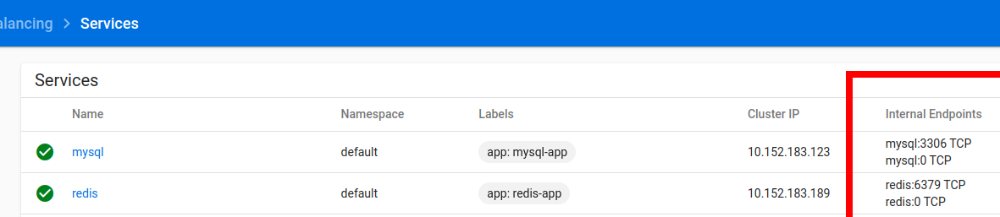

# start k8s/dns
```bash 
$ microk8s status
microk8s is running
addons:
dashboard: enabled
dns: enabled

```
# dashboard 中就可以看到所有service 的internal endpoint


## service's name for dns
<service-name>.<namespace-name>.svc.cluster.local

# test
start a pod then test the dns inside it

```bash
$ kubectl run -it --image=busybox --rm --restart=Never sh
If you don't see a command prompt, try pressing enter.
/ # ping mysql
PING mysql (10.152.183.123): 56 data bytes
^C
--- mysql ping statistics ---
3 packets transmitted, 0 packets received, 100% packet loss
/ # ping mysql.default
PING mysql.default (10.152.183.123): 56 data bytes
^C
--- mysql.default ping statistics ---
4 packets transmitted, 0 packets received, 100% packet loss
/ # exit
pod "sh" deleted
pod default/sh terminated (Error)

```

