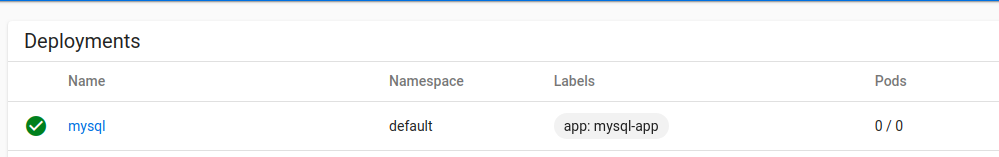

# target
keep DB's data not lose during POD restarting/recreating.

# reclaim policy
 For dynamically provisioned PersistentVolumes, the default reclaim policy is “Delete”. This means that a dynamically provisioned volume is automatically deleted when a user deletes the corresponding PersistentVolumeClaim. This automatic behavior might be inappropriate if the volume contains precious data. In that case, it is more appropriate to use the “Retain” policy. With the “Retain” policy, if a user deletes a PersistentVolumeClaim, the corresponding PersistentVolume is not be deleted. Instead, it is moved to the Released phase, where all of its data can be manually recovered.

 so change the PV's reclaim policy to "Retain"

# MySQL POD test
the test steps is just like [MySQL in k8s cluster](k8s_mysql.md). but between
* exec inside pod 
* access MySQL outside k8s

to recrate the POD by scaling down the deployment's POD to 0.

# Redis POD test
Work too.