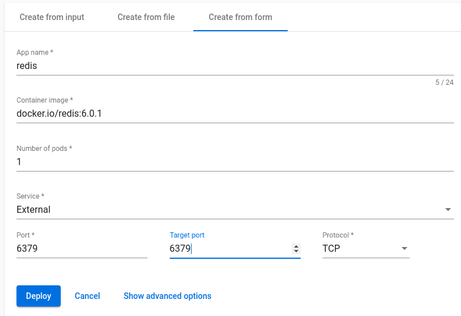
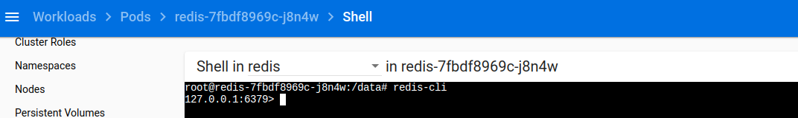

# env
microk8 is ready

# try the config/script used in minikube before
```bash
$ ./create_map.sh 
configmap/redis-config created
$ kubectl create -f redis-deployment.yaml 
deployment.apps/redis created
$ kubectl delete deployment redis
```
可见基本语法还是没有改变，与标准k8s应该是兼容的。

# create via gui
```
$ docker pull redis
docker.io/library/redis:latest
$ microk8s ctr images  pull docker.io/redis:latest
```


# exec into pod:redis


# exec outside the k8s
```bash
$ src/redis-cli -h 10.152.183.183
10.152.183.183:6379> get name
"john"
10.152.183.183:6379> 
```
note: 10.152.183.183 是 redis 这个service 的 ip address.
