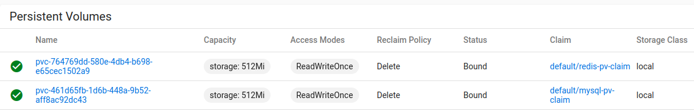

storage: Create a default storage class which allocates storage from a host directory.
ref:  https://kubernetes.io/docs/concepts/storage/storage-classes/


# enable storage
```bash
$ microk8s enable storage
Enabling default storage class
deployment.apps/hostpath-provisioner created
storageclass.storage.k8s.io/microk8s-hostpath created
serviceaccount/microk8s-hostpath created
clusterrole.rbac.authorization.k8s.io/microk8s-hostpath created
clusterrolebinding.rbac.authorization.k8s.io/microk8s-hostpath created
Storage will be available soon
```

# create storage class
既然microk8s 已经自带storage class microk8s-hostpath，直接用它也可以,不过为了不要与microk8s耦合太多，还是自己创建了[local class](storage.yaml)
```bash
$ kubectl apply -f storage.yaml 
storageclass.storage.k8s.io/local created
```
# use new storage class

```bash
$ kubectl apply -f mysql-pv.yaml
persistentvolumeclaim/mysql-pv-claim created
```
# summary
comparing with 
* [storageClassName: manual](mysql-pv-old.yaml)，
* [new yaml](mysql/mysql-pv.yaml)

The benefit of storage is: no need to create PV(Persistent Volumes) mnaually,as they will generating automatically.


but the benefit also harm the flexibility of configuration, so decide to disable it.

```bash
$ microk8s disable storage
Disabling default storage
deployment.apps "hostpath-provisioner" deleted
storageclass.storage.k8s.io "microk8s-hostpath" deleted
serviceaccount "microk8s-hostpath" deleted
clusterrole.rbac.authorization.k8s.io "microk8s-hostpath" deleted
clusterrolebinding.rbac.authorization.k8s.io "microk8s-hostpath" deleted
Storage removed
Remove PVC storage at /var/snap/microk8s/common/default-storage ? (Y/N): y
Storage space reclaimed
```


