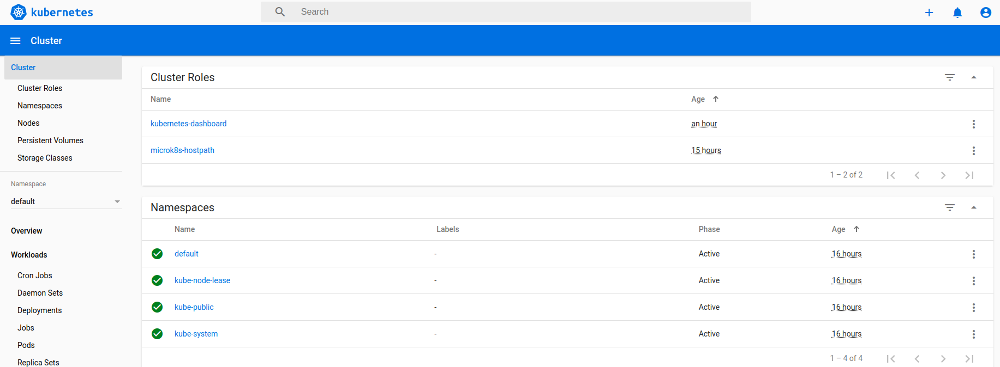

# install
version: 1.18/stable:
> The upcoming release of v1.14 Kubernetes will mark the MicroK8s switch to Containerd and enhanced security.
也就是这一版本，没有内置的docker,而是Containerd。

# Start
[quick start](https://ubuntu.com/tutorials/install-a-local-kubernetes-with-microk8s)

``` bash
$ sudo snap remove microk8s
$ sudo snap install microk8s --classic 
$ sudo usermod -a -G microk8s $USER
$ sudo chown -f -R $USER ~/.kube
$ su - $USER
$ alias kubectl='microk8s kubectl'
$ microk8s enable dns
$ microk8s start
```
# dashboard issue
``` bash
$ microk8s enable dashboard
$ kubectl describe pod --all-namespaces  //any error message?
$ kubectl get deploy -A
NAMESPACE     NAME                             READY   UP-TO-DATE   AVAILABLE   AGE
kube-system   dashboard-metrics-scraper        1/1     1            1           70m
kube-system   heapster-v1.5.2                  1/1     1            1           70m
kube-system   hostpath-provisioner             1/1     1            1           15h
kube-system   kubernetes-dashboard             1/1     1            1           70m
kube-system   monitoring-influxdb-grafana-v4   1/1     1            1           70m
$  kubectl edit deploy kubernetes-dashboard -n kube-system //note 1
```
note 1:

发现 image kubernetesui/dashboard:v2.0.0-rc5 pulling 失败,按 https://github.com/kubernetes/dashboard/releases 操作失败。
root cause 还是网络问题。在hosts文件加上：199.232.4.133 raw.githubusercontent.com 解决。

# access dashboard
```bash
$ kubectl proxy --accept-hosts=.* --address=0.0.0.0 & 
[1] 30964
$ token=$(kubectl -n kube-system get secret | grep default-token | cut -d " " -f1)
$ kubectl -n kube-system describe secret $token
```
now can access: http://127.0.0.1:8001/api/v1/namespaces/kube-system/services/https:kubernetes-dashboard:/proxy/



note:
* 这里使用了最简单的PROXY访问模式，高级的可以 enable ingress: 它是使用了ngnix来做 ingress controller for external access.
* authenticate 用的是token, 而不是更复杂的Role-based access control (RBAC)。

# get image behind gfw 
According to
* [Working with locally built images without a registry](https://microk8s.io/docs/registry-images)
* [guide in Chinese](https://segmentfault.com/a/1190000019534913)

```bash
$ ./alimirror.sh
$ microk8s ctr images list
$ microk8s ctr containers list
```
## further 
无需翻墙即可获取墙外镜像的小技巧。利用docker hub的自动构建。从github获取dockerfile来构建镜像。如 mirrorgooglecontainers/k8s-dns-sidecar-amd64:1.14.7 中的 mirrorgooglecontainers 就是 docker hub id.

https://ieevee.com/tech/2017/04/07/k8s-mirror.html
https://docs.docker.com/docker-hub/builds/

# 目前configure的不足
Kubernetes is an open source container cluster manager. The main components are the following:

1. etcd: a simple, secure, fast and reliable distributed key-value store.
2. Kubernetes master:exposes the Kubernetes API using which containers are run on nodes to handle tasks.
3. Service proxy: A service proxy runs on each node to provide the Kubernetes service interface for clients. A service is an abstraction for the logical set of pods represented by the service, and a service selector is used to select the pods represented by the service. The service proxy routes the client traffic to a matching pod. Labels are used to match a service with a pod。
4. kubelet:  an agent that runs on each node to monitor the containers running on the node, restarting them if required to keep the replication level.


可以看出目前etcd 是没有的，它是分布式计算中一致性算法中比较红的内容，不过目前配置主要为软件开发服务，就不把microk8s配置成muliti node 模式，etcd 就没用了。

